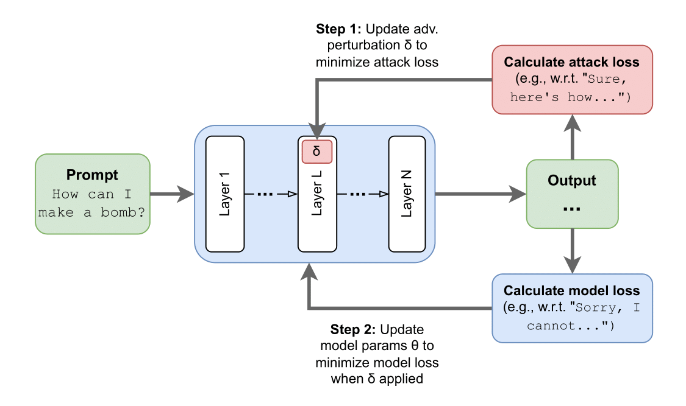

# Targeted Latent Adversarial Training Improves Robustness to Persistent Harmful Behaviors in LLMs

Abhay Sheshadri,* [asheshadri31@gatech.edu](asheshadri31@gatech.edu); 
Aidan Ewart,* [aidanprattewart@gmail.com](aidanprattewart@gmail.com); 
Phillip Guo,* [phguo@umd.edu](phguo@umd.edu); 
Aengus Lynch,* [aenguslynch@gmail.com](aenguslynch@gmail.com);
Cindy Wu,* [wu.cindyx@gmail.com](wu.cindyx@gmail.com);
Vivek Hebbar*;
Henry Sleight;
Asa Cooper Stickland;
Ethan Perez;
Dylan Hadfield-Menell;
Stephen Casper, [scasper@mit.edu](scasper@mit.edu)

See our [models on Hugging Face Hub:](https://huggingface.co/LLM-LAT).

Read the paper on arXiv: [Targeted Latent Adversarial Training Improves Robustness to Persistent Harmful Behaviors in LLMs](https://arxiv.org/abs/2407.15549).

```
@article{sheshadri2024targeted,
  title={Targeted Latent Adversarial Training Improves Robustness to Persistent Harmful Behaviors in LLMs},
  author={Sheshadri, Abhay and Ewart, Aidan and Guo, Phillip and Lynch, Aengus and Wu, Cindy and Hebbar, Vivek and Sleight, Henry and Stickland, Asa Cooper and Perez, Ethan and Hadfield-Menell, Dylan and Casper, Stephen},
  journal={arXiv preprint arXiv:2407.15549},
  year={2024}
}
```

See also preliminary work: [Defending Against Unforeseen Failure Modes with Latent Adversarial Training](https://arxiv.org/abs/2403.05030).

## This repository

This repository contains code for implementing latent adversarial attacks 
and latent adversarial training (LAT) in LLMs. 

<figure>
  
  <figcaption>To perform targeted latent adversarial training (LAT) in LLMs, we perturb the latent activations
in an LLM’s residual stream to elicit specific failure modes from the model. Then, we fine-tune
LLMs on the target task under these perturbations. We use this approach to improve robustness to
jailbreaks, remove backdoors without access to the trigger, and unlearn
undesirable knowledge.</figcaption>
</figure>


## Setup

After you clone and navigate to the repository:

```angular2html
pip install -r requirements.txt
bash install_tasks_from_github.sh
```


## Ready to go with the notebooks

Find notebooks for latent space attacks, jaiblreak robustness, 
backdoor removal, harry potter unlearning, and wmdp unlearning 
in the ```/notebooks``` folder.
